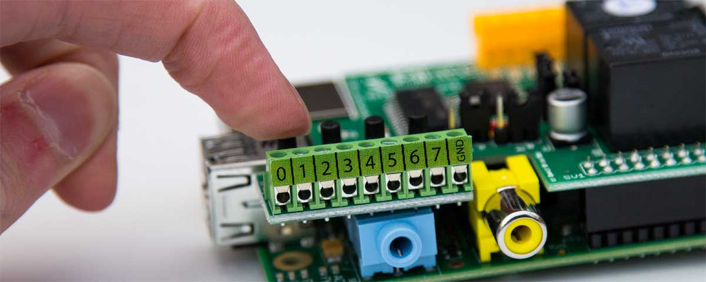
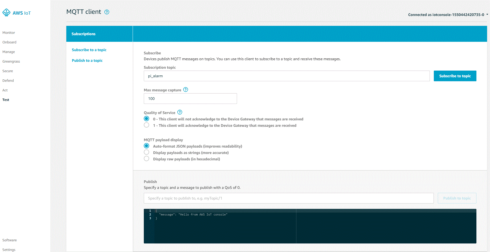
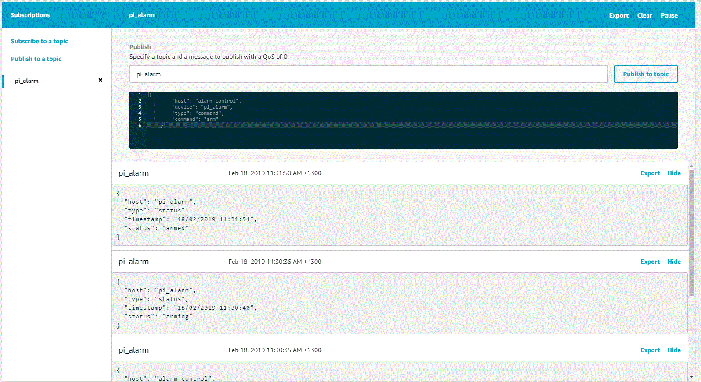

# PIFace_Alarm

PIFace_Alarm is a Raspberry PI Node.js based alarm application utilising the [PI_Face Digital 2](http://www.piface.org.uk/products/piface_digital_2/) interface. It allows for the configuration of 8 wired inputs (preferably PIR sensors), and 8 wired outputs that can be grouped as Buzzers (Sounded when arm or warning events are triggered) or Sirens (Sounded when alarm is trigged)



## Installation

Download and unpack this repository on the Raspberry PI device with the PI_Face Digital 2 board installed. This code will be dependant on the libraries installed from the node-pifacedigital package https://www.npmjs.com/package/node-pifacedigital. Make sure to follow the setup instructions listed on the [node-pifacedigital readme](https://www.npmjs.com/package/node-pifacedigital), and enable the SPI functionality. Once the node-pifacedigital libraries a installed you should then be able to use NPM to install the rest of the dependancies.

```bash
$ npm install
```

## Configuration

All config options are located within the [./config/default.json](./config/default.json) file

You should only need to edit the `AWS` and `Alarm` objects with the config file, and add the required [environment variables](#environment-variables).

The `AWS` object will need to contain your [certificate](#aws-messaging) information

The `Alarm` object is where you can setup the [inputs](#inputs) and [outputs](#outputs) you require for you Alarm system. 

## Inputs

There are 8 `inputs` that are configured as alarm zones for use with a hardwired [PIR sensor](https://learn.adafruit.com/pir-passive-infrared-proximity-motion-sensor/how-pirs-work). The default is configured with an `event` type of `hilo` which correspondes to the `PIR` sensor `C/NC` events as descirbed [here](http://www.reuk.co.uk/wordpress/electronics/pir-sensor-circuits/). This means when the circuit is closed, and event is triggered. Change this to a value of `lohi` if your device triggers on the circuit being broken.

## Outputs

The `PI_Face Digital 2` 8 `outputs` that can be configure as either a `Buzzer` or `Siren`.

A `Buzzer` is used during the `Arm` phase of the alarm to notify the user of the arm count down. It is also used during the Zone trigger phase when the alarm is active to notify the user within the area that an Alert is about to be triggered, should they wish to disarm the system.

A `Siren` is used after the alarm `Buzzer` has completed its warnings, and the alarm is now sounding to alert anyone in the area that it has been triggered.

## Environment Variables

The following environment variables will need to be set on the Raspberry Pi device.

| Environment variable | Description |
|----------------------|-------------|
| `piface_alarm_jwtPrivateKey` | this variable is mandatory and must be used to specify the key needed by the application to create JSON web tokens |
| `piface_alarm_getTokenKey` | key used for authentication to initally retrieve JSON web token for use in API requests|
| `piface_alarm_poApiKey` | Pushover API key - for push notification services|
| `piface_alarm_poUserKey` | Pushover User Key - for push notification services |

I recommend adding them to the `.bashrc` file of the account you will be using to run this node.js app. Replace `KeyString, PushoverAPIKey, and PushoverUserKey` with you own values.

```bash
echo export "piface_alarm_jwtPrivateKey=KeyString" >> .bashrc
echo export "piface_alarm_getTokenKey=KeyString" >> .bashrc
echo export "piface_alarm_poApiKey=PushoverAPIKey" >> .bashrc
echo export "piface_alarm_poUserKey=PushoverUserKey" >> .bashrc
```

## API

piface_alarm has a simple JSON API that provides 4 functions.

| Endpoint | Function |
| -------- | -------- |
| `/api/alarm/status` | responds with the alarms status object |
| '/api/alarm/on' | Arms the alarm system |
| '/api/alarm/off' | Disarms the alarm system |
| '/api/alarm/token/:key' | Returns a JSON Web Token to use in future requests |

## Authentication

The first time you run piface_alarm, you will need to retrieve a JSON Web Token in order to authenticate requests by calling...

`http://<ip of your piface_alarm>/api/alarm/token/<getTokenKey>`

Append this value as a header with the name `x-auth-token` when calling the `status, on, off` endpoints.

## AWS Messaging

piface_alarm uses [AWS IOT Core](https://aws.amazon.com/iot-core/) MQTT/Device Shadows in order to communicate events, and allow for remote control. You will need to create an AWS account and set up an IOT device/thing with the name `piface_alarm` and copy the certifcates into the [./certificates](.certificates) directory and update the `AWS` object in the [./config/default.json](./config/default.json) file with the certifcate filenames, host, and clientId. Make sure you use the same clientId as the `device/thing` you created `piface_alarm`.

I recommend using a policy with iot:* and resources * for initial setup, and then locking it down once everything is running correctly.

`{
  "Version": "2012-10-17",
  "Statement": [
    {
      "Effect": "Allow",
      "Action": "iot:*",
      "Resource": "*"
    }
  ]
}`

There are example messages, a device shadow, and policy within the [./samples/awsIOT]](./samples/awsIOT) directory. The default is configured to use the `piface_alarm` topic for status events and control. 

Within the AWS IOT Core console, select the "Test" option to open the MQTT client. Then subscribe to the correct topic, the default is `piface_alarm`, you should the be able to see messages sent from the piface_alarm service.



To set the alarm via aws copy the "arm" message from [./samples/awsIOT/message.json](./samples/awsIOT/message.json) 

`{
        "host": "alarm control",
        "device": "piface_alarm",
        "type": "command",
        "command": "arm"
 }`
    


To disarm simply paste the "disarm" packet to the `piface_alarm` topic

`{
        "host": "alarm control",
        "device": "piface_alarm",
        "type": "command",
        "command": "disarm"
 }`
 
 ## Pushover notifications
 
 This app uses the [Pushover](https://pushover.net/) notification API in order to send an alert when the Alarm is triggered. You will need to create an account and `pushover` application\API token and add the API and User key values to the [environment variables](#environment-variables). The Pushover client for mobile devices can be downloaded from the [App Store / Google Play](https://pushover.net/clients), and you will need to add you device to a group assigned to the application within Pushover, detailed information can be found [here](https://pushover.net/faq#overview-what)
 
 ## Run
 
 I recommend using the nodemon process to run this app, as any changes you make to the files will automatically restart the application while you are setting up and configuring `piface_alarm`
 
 ```bash
 cd piface_alarm
 nodemon index.js
```
